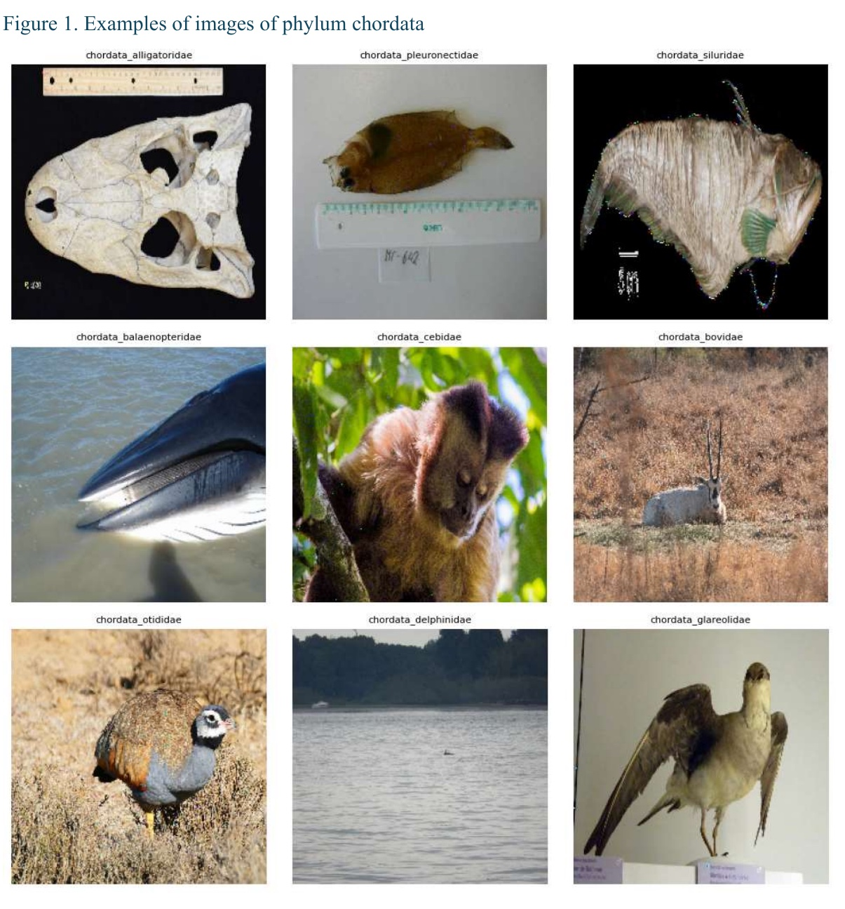

# Rare Species Family Classification

This project builds a deep learning model to classify rare species images into biological families. It uses TreeOfLife rare species images, compares custom CNN and transfer-learning approaches, and selects an EfficientNetV2B1-based final model with image and phylum metadata inputs.

## Methods and Tools

| Area | Used in this project |
| --- | --- |
| Classification setup | Fine-grained 202-class rare species family classification |
| Modeling | Custom CNN baselines, transfer learning, EfficientNetV2B1 final model |
| Multi-input learning | Image branch combined with one-hot encoded phylum metadata |
| Training experiments | Augmentation strategy comparison, batch-size search, backbone comparison, frozen-base and fine-tuning runs |
| Evaluation | Macro F1 for class imbalance, weighted F1, train/validation/test comparison |
| Python tools | TensorFlow, Keras, KerasCV, Keras Tuner, OpenCV, Pillow, pandas, NumPy, scikit-learn |

## Key Outcomes

- Built a deep learning pipeline for rare species family classification using 11,983 images across 202 biological families.
- Compared custom CNNs, augmentation strategies, metadata fusion, batch sizes, and multiple transfer-learning backbones.
- Improved validation macro F1 from 22.25% with the best custom CNN baseline to 74.4% with the final EfficientNetV2B1-based model.
- Reached 74.7% test macro F1 and 75.36% test weighted F1 on a strongly imbalanced fine-grained image classification task.

## Challenges and Design Choices

| Challenge | Design choice |
| --- | --- |
| Imbalanced 202-class family classification | Used macro F1 as the main metric so each family contributes equally, reported weighted F1 for comparison, and emphasized transfer learning over the custom CNN baseline. |
| Limited rare-species image data | Compared pretrained backbones and selected EfficientNetV2B1 with ImageNet weights to improve generalization on a small fine-grained dataset. |
| Combining image and metadata inputs | Built a multi-input model: EfficientNetV2B1 extracts image features, phylum metadata is one-hot encoded, and both feature streams are concatenated before the classification head. |

## Data

The dataset contains 11,983 images from the TreeOfLife rare species collection, covering 202 animal families from the Animalia kingdom. The target variable is the biological family.

Example images from the report illustrate the visual diversity of the classification task. The labels above each image correspond to biological families.

<p align="center">
  
</p>

The dataset is strongly imbalanced: most families have fewer than 50 images, while only a small number have more than 200 images. This imbalance motivated the use of macro F1 as the main evaluation metric, because each family should contribute equally regardless of how many images it contains.

<p align="center">
  
</p>

The image dataset is not included in this repository because of size and distribution constraints.

Download the dataset from:

```text
https://drive.google.com/file/d/1PyxqW_nsORX4PetkQo6OIL0mUL1pFsTD/view
```

## Project

The work follows two modeling tracks:

1. Build a CNN from scratch as a learning baseline.
2. Compare transfer-learning pipelines using pretrained image backbones.

The final model combines:

- Image input resized to `224x224x3`
- `EfficientNetV2B1` with ImageNet weights and frozen convolutional base
- Global average pooling over image features
- One-hot encoded phylum metadata as a second input
- Concatenation of image and tabular features
- Dropout of `0.1`
- Softmax classification head with 202 output classes
- RMSprop optimizer with cosine decay
- Categorical cross-entropy without label smoothing

<p align="center">
  
</p>

The architecture diagram is reproduced from the report. The implementation in `scripts/train_final_model.py` instantiates `EfficientNetV2B1`.

## Results

The final frozen-base model reached:

- Train macro F1: 98.4%
- Validation macro F1: 74.4%
- Test macro F1: 74.7%
- Test weighted F1: 75.36%

<p align="center">
  
</p>

The following table summarizes the main transfer-learning experiments from the report. Values are macro F1 percentages. `*` marks configurations with the best validation macro F1 score in their experiment group.

<details>
<summary>Expand transfer-learning experiment table</summary>

| Experiment group | Configuration | Train macro F1 (%) | Validation macro F1 (%) |
| --- | --- | ---: | ---: |
| Feature selection | Without tabular data | 70.94 | 65.40 |
|  | With tabular data, no dense layer after concat | 72.30 | 66.58 * |
|  | With tabular data, dense layer after concat | 70.97 | 66.28 * |
| Batch size | 32 | 71.82 | 66.01 |
|  | 64 | 83.03 | 70.82 |
|  | 128 | 88.60 | 72.16 * |
|  | 224 | 89.94 | 71.69 * |
| Augmentations pre-tune | None | 85.52 | 68.51 * |
|  | Random contrast | 84.52 | 67.38 |
|  | Random flip H+V | 76.49 | 66.96 |
|  | Random flip H | 84.70 | 68.43 * |
|  | Random rotation | 72.37 | 66.19 |
|  | Random zoom | 78.97 | 67.06 |
|  | Random crop resize | 81.03 | 67.02 |
|  | Random Gaussian blur | 85.88 | 68.40 * |
|  | Random hue | 81.38 | 65.45 |
|  | Random channel shift | 82.16 | 65.85 |
| Augmentation fine-tune | None | 97.37 | 73.38 * |
|  | Random contrast | 97.58 | 73.44 * |
|  | Random flip H | 97.26 | 73.31 * |
|  | Random rotation | 87.05 | 71.89 |
|  | Random zoom | 94.37 | 73.34 * |
|  | Random Gaussian blur | 97.36 | 73.45 * |
| Combined augmentation fine-tune | None | 97.87 | 74.22 * |
|  | Manual combined | 94.42 | 73.46 * |
|  | RandAugment | 85.14 | 68.48 |
| Base model selection pre-tune | Xception | 89.69 | 56.52 |
|  | ResNet50V2 | 91.34 | 55.73 |
|  | InceptionV3 | 92.35 | 51.79 |
|  | DenseNet121 | 74.38 | 60.06 |
|  | EfficientNetB0 | 92.09 | 71.96 * |
|  | EfficientNetV2B1 | 87.69 | 71.09 * |
|  | EfficientNetV2S | 82.38 | 68.10 |
|  | ConvNeXtTiny | 81.23 | 65.50 |
| Base model selection fine-tune | EfficientNetB0 | 94.87 | 74.05 |
|  | EfficientNetV2B1 | 95.75 | 75.19 * |

</details>

The best custom CNN from scratch reached 22.25% validation macro F1. This gap supports the main project conclusion: transfer learning is much more effective for this small, imbalanced, fine-grained image dataset.

## Repository Structure

```text
.
├── requirements.txt                # Python dependencies
├── scripts/
│   ├── prepare_data.py             # Dataset split and metadata preparation
│   ├── train_final_model.py        # Final model training and test evaluation
│   └── evaluate_saved_model.py     # Evaluate the saved model on train/val/test
├── src/
│   └── rare_species_classification/
│       ├── __init__.py
│       └── utils.py                # Data loading, model building, training helpers
├── models/
│   └── best_model.h5               # Saved final model artifact
├── notebooks/
│   ├── 1_Building_original_model.ipynb
│   ├── 2_Original_model_with_augmentation.ipynb
│   ├── 3_Transfer_learning_selection.ipynb
│   ├── 4_Final_model.ipynb
│   └── 5_Variational_autoencoder.ipynb
├── docs/
│   └── assets/                    # Figures extracted from the final report
├── report/
│   └── GROUP_20.pdf
└── utils_.py                       # Compatibility shim for original notebooks
```

## Scripts and Usage

Create and activate a virtual environment:

```bash
python -m venv .venv
source .venv/bin/activate
```

Install the dependencies:

```bash
pip install -r requirements.txt
```

Prepare the dataset:

Place the extracted dataset folder in the project root with the default name expected by `scripts/prepare_data.py`:

```text
rare_species 1/
├── metadata.csv
├── class_folder_1/
├── class_folder_2/
└── ...
```

Then run:

```bash
python scripts/prepare_data.py
```

This creates:

```text
data/
├── train/
├── val/
├── test/
├── metadata_train.csv
├── metadata_val.csv
└── metadata_test.csv
```

Train and evaluate the final model:

```bash
python scripts/train_final_model.py
```

Optional arguments:

```bash
python scripts/train_final_model.py --epochs 80 --batch_size 128 --image_size 224,224
```

Arguments:

- `--epochs`: number of training epochs, default `80`
- `--batch_size`: batch size, default `128`
- `--image_size`: input image size as `HEIGHT,WIDTH`, default `224,224`

Main scripts:

- `scripts/prepare_data.py`: splits the downloaded dataset into train, validation, and test folders and creates matching metadata CSV files.
- `scripts/train_final_model.py`: loads prepared images and metadata, builds the final EfficientNetV2B1 dual-input model, trains it, and evaluates it on the test split.
- `scripts/evaluate_saved_model.py`: loads `models/best_model.h5` and evaluates it on a selected prepared split.
- `src/rare_species_classification/utils.py`: contains reusable functions for image loading, metadata alignment, model construction, compilation, training, evaluation, and plotting.

Evaluate the saved model on a prepared split:

```bash
python scripts/evaluate_saved_model.py --split test --model models/best_model.h5
```

The `--split` argument accepts `train`, `val`, or `test`. The command expects the prepared `data/` folder and metadata CSV files created by `scripts/prepare_data.py`.

Training writes runtime artifacts such as `checkpoint.keras` and `metrics.csv`.

## Saved Artifacts

The repository includes:

- `models/best_model.h5`: saved model artifact from the notebook workflow
- `report/GROUP_20.pdf`: project report with experiment details

The raw image dataset and generated `data/` directory are intentionally excluded from version control.

## Notes

This project was developed as part of a 2024/2025 deep learning course project. It is intended as a reproducible research/code portfolio project rather than a packaged Python library.
