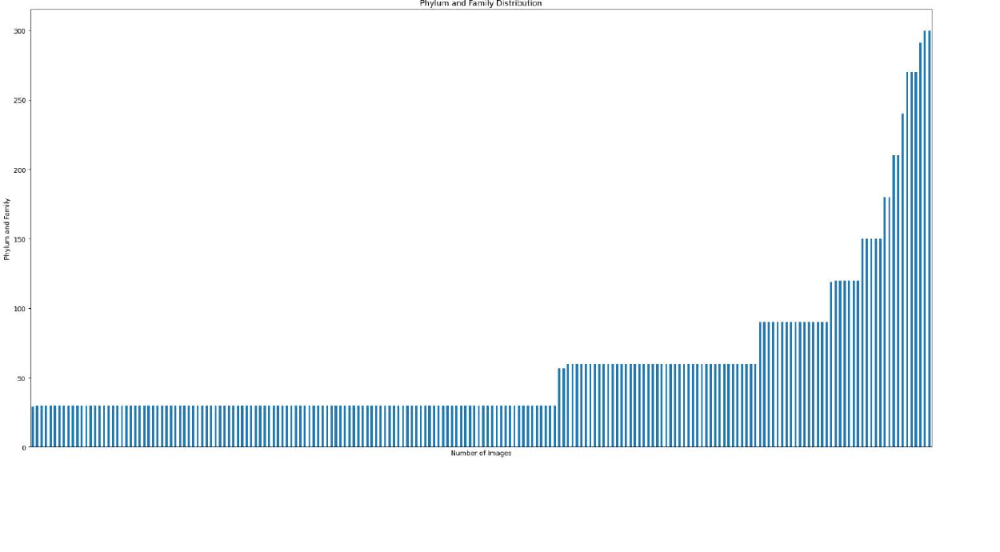
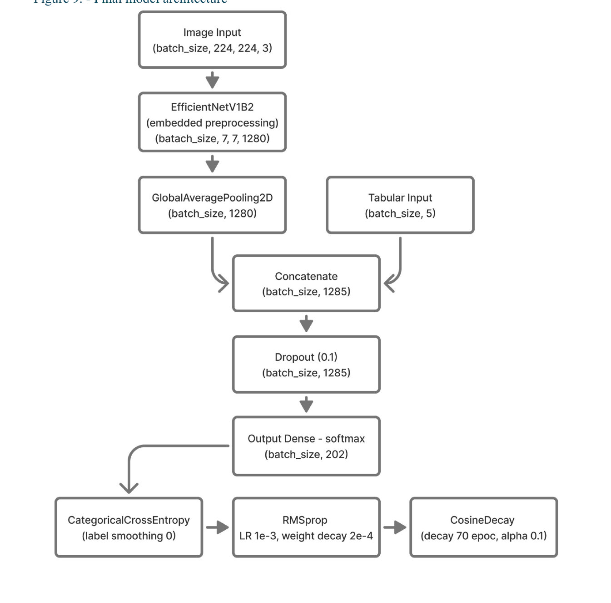
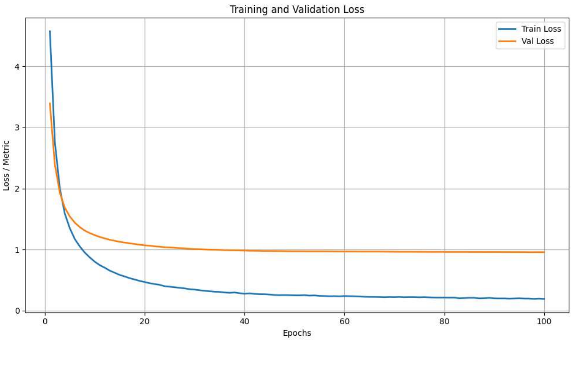

# Rare Species Family Classification

This project builds a deep learning model to classify rare species images into biological families. It uses TreeOfLife rare species images, compares custom CNN and transfer-learning approaches, and selects an EfficientNetV2B1-based final model with image and phylum metadata inputs.

## Data

The dataset contains 11,983 images from the TreeOfLife rare species collection, covering 202 animal families from the Animalia kingdom. The target variable is the biological family.

The dataset is strongly imbalanced: most families have fewer than 50 images, while only a small number have more than 200 images. This imbalance motivated the use of macro F1 as the main evaluation metric, because each family should contribute equally regardless of how many images it contains.



The image dataset is not included in this repository because of size and distribution constraints.

Download the dataset from:

```text
https://drive.google.com/file/d/1PyxqW_nsORX4PetkQo6OIL0mUL1pFsTD/view
```

## Project

The work follows two modeling tracks:

1. Build a CNN from scratch as a learning baseline.
2. Compare transfer-learning pipelines using pretrained image backbones.

The final model combines:

- Image input resized to `224x224x3`
- `EfficientNetV2B1` with ImageNet weights and frozen convolutional base
- Global average pooling over image features
- One-hot encoded phylum metadata as a second input
- Concatenation of image and tabular features
- Dropout of `0.1`
- Softmax classification head with 202 output classes
- RMSprop optimizer with cosine decay
- Categorical cross-entropy without label smoothing



The architecture diagram is reproduced from the report. The implementation in `main.py` instantiates `EfficientNetV2B1`.

## Results

The final frozen-base model reached:

- Train macro F1: 98.4%
- Validation macro F1: 74.4%
- Test macro F1: 74.7%
- Test weighted F1: 75.36%



The following table summarizes the main transfer-learning experiments from the report. Values are macro F1 percentages. `*` marks configurations with the best validation macro F1 score in their experiment group.

| Experiment group | Configuration | Train macro F1 (%) | Validation macro F1 (%) |
| --- | --- | ---: | ---: |
| Feature selection | Without tabular data | 70.94 | 65.40 |
| Feature selection | With tabular data, no dense layer after concat | 72.30 | 66.58 * |
| Feature selection | With tabular data, dense layer after concat | 70.97 | 66.28 * |
| Batch size | 32 | 71.82 | 66.01 |
| Batch size | 64 | 83.03 | 70.82 |
| Batch size | 128 | 88.60 | 72.16 * |
| Batch size | 224 | 89.94 | 71.69 * |
| Augmentations pre-tune | None | 85.52 | 68.51 * |
| Augmentations pre-tune | Random contrast | 84.52 | 67.38 |
| Augmentations pre-tune | Random flip H+V | 76.49 | 66.96 |
| Augmentations pre-tune | Random flip H | 84.70 | 68.43 * |
| Augmentations pre-tune | Random rotation | 72.37 | 66.19 |
| Augmentations pre-tune | Random zoom | 78.97 | 67.06 |
| Augmentations pre-tune | Random crop resize | 81.03 | 67.02 |
| Augmentations pre-tune | Random Gaussian blur | 85.88 | 68.40 * |
| Augmentations pre-tune | Random hue | 81.38 | 65.45 |
| Augmentations pre-tune | Random channel shift | 82.16 | 65.85 |
| Augmentation fine-tune | None | 97.37 | 73.38 * |
| Augmentation fine-tune | Random contrast | 97.58 | 73.44 * |
| Augmentation fine-tune | Random flip H | 97.26 | 73.31 * |
| Augmentation fine-tune | Random rotation | 87.05 | 71.89 |
| Augmentation fine-tune | Random zoom | 94.37 | 73.34 * |
| Augmentation fine-tune | Random Gaussian blur | 97.36 | 73.45 * |
| Combined augmentation fine-tune | None | 97.87 | 74.22 * |
| Combined augmentation fine-tune | Manual combined | 94.42 | 73.46 * |
| Combined augmentation fine-tune | RandAugment | 85.14 | 68.48 |
| Base model selection pre-tune | Xception | 89.69 | 56.52 |
| Base model selection pre-tune | ResNet50V2 | 91.34 | 55.73 |
| Base model selection pre-tune | InceptionV3 | 92.35 | 51.79 |
| Base model selection pre-tune | DenseNet121 | 74.38 | 60.06 |
| Base model selection pre-tune | EfficientNetB0 | 92.09 | 71.96 * |
| Base model selection pre-tune | EfficientNetV2B1 | 87.69 | 71.09 * |
| Base model selection pre-tune | EfficientNetV2S | 82.38 | 68.10 |
| Base model selection pre-tune | ConvNeXtTiny | 81.23 | 65.50 |
| Base model selection fine-tune | EfficientNetB0 | 94.87 | 74.05 |
| Base model selection fine-tune | EfficientNetV2B1 | 95.75 | 75.19 * |

The best custom CNN from scratch reached 22.25% validation macro F1. This gap supports the main project conclusion: transfer learning is much more effective for this small, imbalanced, fine-grained image dataset.

## Repository Structure

```text
.
├── main.py                         # Final training and evaluation entry point
├── utils_.py                       # Data loading, model building, training helpers
├── organizing_folders.py           # Dataset split and metadata preparation script
├── requirements.txt                # Python dependencies
├── preinstall.txt                  # Minimal pre-install dependency list
├── notebooks/
│   ├── 1_Building_original_model.ipynb
│   ├── 2_Original_model_with_augmentation.ipynb
│   ├── 3_Transfer_learning_selection.ipynb
│   ├── 4_Final_model.ipynb
│   ├── 5_Variational_autoencoder.ipynb
│   └── best_model.h5
├── docs/
│   └── assets/                    # Figures extracted from the final report
└── report/
    └── GROUP_20.pdf
```

## Scripts and Usage

Create and activate a virtual environment:

```bash
python -m venv .venv
source .venv/bin/activate
```

Install the dependencies:

```bash
pip install -r preinstall.txt
pip install -r requirements.txt
```

Prepare the dataset:

Place the extracted dataset folder in the project root with the name expected by `organizing_folders.py`:

```text
rare_species 1/
├── metadata.csv
├── class_folder_1/
├── class_folder_2/
└── ...
```

Then run:

```bash
python organizing_folders.py
```

This creates:

```text
data/
├── train/
├── val/
├── test/
├── metadata_train.csv
├── metadata_val.csv
└── metadata_test.csv
```

Train and evaluate the final model:

```bash
python main.py
```

Optional arguments:

```bash
python main.py --epochs 80 --batch_size 128 --image_size 224,224
```

Arguments:

- `--epochs`: number of training epochs, default `80`
- `--batch_size`: batch size, default `128`
- `--image_size`: input image size as `HEIGHT,WIDTH`, default `224,224`

Main scripts:

- `organizing_folders.py`: splits the downloaded dataset into train, validation, and test folders and creates matching metadata CSV files.
- `main.py`: loads prepared images and metadata, builds the final EfficientNetV2B1 dual-input model, trains it, and evaluates it on the test split.
- `utils_.py`: contains reusable functions for image loading, metadata alignment, model construction, compilation, training, evaluation, and plotting.

Training writes runtime artifacts such as `checkpoint.keras` and `metrics.csv`.

## Saved Artifacts

The repository includes:

- `notebooks/best_model.h5`: saved model artifact from the notebook workflow
- `report/GROUP_20.pdf`: project report with experiment details

The raw image dataset and generated `data/` directory are intentionally excluded from version control.

## Notes

This project was developed as part of a 2024/2025 deep learning course project. It is intended as a reproducible research/code portfolio project rather than a packaged Python library.
